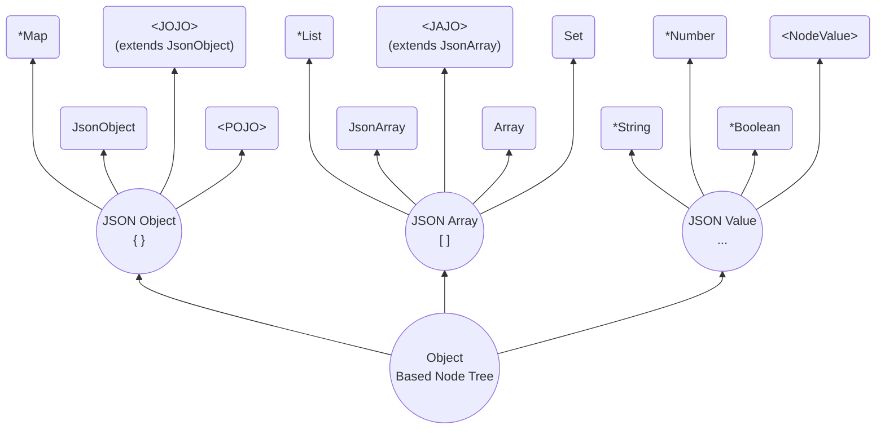

# Model

## Object Based Node Tree

SJF4J represents structured data as an **Object Based Node Tree (OBNT)**.

Instead of introducing a dedicated AST hierarchy (e.g. `JsonNode`, `JsonElement`),
OBNT uses **plain Java objects as nodes**. Any node in the tree is one of:

- JSON Object → `Map`, `JsonObject`, or a typed object (`POJO` / `JOJO`)
- JSON Array → `List`, `JsonArray`, `JAJO`, native arrays, or `Set`
- JSON Value → `String`, `Number`, `Boolean`, `null`, or `NodeValue`



### Why OBNT

**1) One set of JSON-semantic APIs for every node**  
SJF4J treats every node as a first-class citizen. Traversal, query, patch, and validation can be applied uniformly,
regardless of whether a node is a raw `Map/List`, a `JsonObject/JsonArray`, or a typed domain model.

**2) Focus on business**  
Model your domain in the most natural way for your business. All nodes are plain Java objects—they can be stored, 
logged, passed through frameworks, and inspected with standard tools.   
No custom AST or special infrastructure is required. 
SJF4J ensures that any node can be represented as JSON when needed.


### Node Types

**JSON Object `{}`**
- `Map`:  
  A generic key-value representation using standard Java `Map`. 

- `JsonObject`:   
  A lightweight wrapper over a JSON object that provides JSON-semantic APIs,

- `POJO` (Plain Old Java Object):  
  A strongly typed Java object with fields, getters, and setters.
  Great for stable schemas and business logic.

- `JOJO` (JSON Object Java Object):  
  A hybrid model that extends `JsonObject` while behaving like a typed Java object. It combines:
  - **static fields** (POJO-style, strongly typed), and
  - **dynamic properties** (JSON-style, preserved as-is)

**JSON Array `[]`**
- `List`   
  A standard Java `List` used as a direct representation of a JSON array.

- `JsonArray`  
  A lightweight wrapper over a JSON array that provides JSON-semantic APIs.

- `JAJO`(JSON Array Java Object)  
  An array type extending `JsonArray`, suitable for domain-specific array models (e.g. `JsonPatch`).

- `Array`  
  A native Java array (e.g. `String[]`) used when a fixed-size, strongly typed representation is desired.

- `Set`  
  A Java `Set` mapped to a JSON array for compatibility, with no ordering guarantees.

**JSON Value `..`**
- `String`, `Number`, `Boolean`, `null`  
  JSON primitive values map directly to Java primitives/wrappers.

- `NodeValue`  
  A typed value representation that preserves JSON semantics while enabling
  custom Java type adaptation (e.g. `LocalDate`, `UUID`).

**Node Type Identification**

OBNT distinguishes between **JSON types** and **node kinds**.

- `JsonType` reflects the standard JSON data model.
- `NodeKind` reflects the OBNT runtime classification.

| JsonType  | NodeKind                                                                       |
|-----------|--------------------------------------------------------------------------------|
| `OBJECT`  | `OBJECT_MAP` / `OBJECT_JSON_OBJECT` / `OBJECT_JOJO` / `OBJECT_POJO`            |
| `ARRAY`   | `ARRAY_LIST` / `ARRAY_JSON_ARRAY` / `ARRAY_JAJO` / `ARRAY_ARRAY` / `ARRAY_SET` |
| `STRING`  | `VALUE_STRING` / `VALUE_STRING_CHARACTER` / `VALUE_STRING_ENUM`                |
| `NUMBER`  | `VALUE_NUMBER`                                                                 |
| `BOOLEAN` | `VALUE_BOOLEAN`                                                                |
| `NULL`    | `VALUE_NULL`                                                                   |
| --        | `VALUE_NODE_VALUE`                                                             |

```java
Object node = new HashMap<String, Object>();

JsonType type = JsonType.of(node);      // JsonType.OBJECT
NodeKind kind = NodeKind.of(node);      // NodeKind.OBJECT_MAP
```

**The Raw Nodes**  
When no target type is specified during parsing or transforming,
each JSON type is mapped to its default raw node type.
- `Map` for JSON objects
- `List` for JSON arrays
- `String`, `Number`, `Boolean`, or `null` for JSON values


## Node Semantics
All nodes in OBNT share a unified set of JSON-semantic operations.  
They are available through:
- Instance methods (`JsonObject`, `JsonArray`)
- The static `Nodes` facade (for raw nodes)

### Access and Conversion
Nodes support both strict access and semantic conversion.

- `toXxx()` performs **type-safe access** (e.g. `Integer → Long`, `Double → Float`)
- `asXxx()` performs **cross-type conversion** (e.g. `String → Number`, `Boolean → String`)

```java
Object node = "123";

Nodes.toString(node);           // -> "123"      
Nodes.asInteger(node);          // -> 123
```

### Structural Operations
Nodes provide container-level operations for objects:
```java
Nodes.sizeInObject(node);
Nodes.containsInObject(node, "name");
Nodes.getInObject(node, "name");
Nodes.visitObject(node, (k, v) -> {...});
```

And the same is arrays.

### Semantic equality, inspection and copying
Equality is defined by JSON structure and value, not by Java object identity.
```java
Nodes.equals(node1, node2);
```

Inspection output includes OBNT-specific details
beyond standard JSON serialization, making it suitable for debugging `JOJO` models.
```java
System.out.println(Nodes.inspect(node));
```

Copy semantics are explicit and predictable.
```java
Nodes.copy(node);               // shallow copy
Sjf4j.deepNode(node);           // deep copy
```

### Traversal
Nodes can be traversed recursively with full path awareness:

```java
Nodes.walk(node, (ps, value) -> {
        System.out.println(ps. + " = " + value);
});
```

### 最常用的 `JsonObject` 


## Modeling Domain Objects with JOJO

JSON is flexible, while POJOs are strict.  
Mapping JSON directly into a POJO often means discarding undeclared fields,
which may reduce the expressive power of the original JSON payload.

[Jackson](https://github.com/FasterXML/jackson-databind) offers one workaround: 
store extra fields in a dedicated map (e.g. via `@JsonAnySetter`).  
SJF4J takes a different approach: `JOJO`.

A `JOJO` is simply a class that extends `JsonObject`:
```java
public class User extends JsonObject {
    String name;
    List<User> friends;
}
```

**Parse from JSON**
```java
String json = """
{
    "name": "Alice",
    "friends": [
        {"name": "Bill", "active": true },
        {"name": "Cindy", "friends": [{"name": "David"}]}
    ],
    "age": 18
}
""";
User user = Sjf4j.fromJson(json, User.class);
```

**Access declared fields and dynamic properties** 
```java
assertEquals("Alice", user.getName());
// Declared fields can be accessed via getters.

assertEquals("Alice", user.getString("name"));
// Or via JSON-semantic APIs.

assertEquals(18, user.getInteger("age"));
// Dynamic properties are preserved and remain accessible.
```

**Inspect the structure**
```java
System.out.println(user);
// @User{*name=Alice, *friends=[@User{*name=Bill, *friends=null, active=true}, ...], age=18}
//        └─────────────┴─────┬─────────┴────────────┘             └───────────┬──────┘
//                            ↓                                                ↓
//              Declared fields in POJO/JOJO                      Dynamic properties in JOJO
```
- Fields marked with * are declared fields.
- Other entries are dynamic properties retained from JSON.

**Use JSON-semantic APIs**
```java
List<String> allFriends = user.findByPath("$.friends..name", String.class);
// ["Bill", "Cindy", "David"] -- all friends and friends of friends.
```

### About JAJO
JAJO is the array counterpart of JOJO, but not allowing additional fields.  
The purpose of JAJO is *modeling rather than structure*. 

For example: `JsonPatch` in SJF4J.
```java
public class JsonPatch extends JsonArray {
    // ...
}
```


