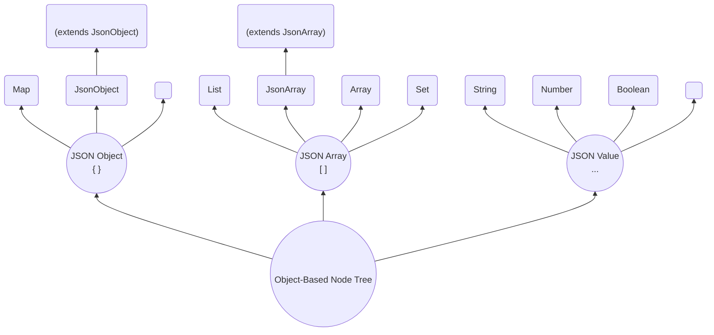

# OBNT & JOJO

## Object-Based Node Tree (OBNT)

SJF4J maps structured data into an **Object-Based Node Tree (OBNT)** and exposes a unified, expressive API for navigation, querying, mutation, and validation.

Unlike traditional JSON libraries that rely on dedicated AST node hierarchies, **all nodes in SJF4J are represented as native Java objects**:



### JSON Object (`{}`)

- **`Map`** — A generic key-value representation using standard Java `Map`.
- **`JsonObject`** — A lightweight wrapper providing JSON-semantic APIs. Can also wrap POJO fields via getter/setter access when backed by a subclass.
- **`<POJO>`** — A strongly typed Java object with fields, getters, and setters.
- **`<JOJO>`** (JSON Object Java Object) — A hybrid that extends `JsonObject` while also behaving like a typed Java object, combining dynamic JSON access with POJO safety.

### JSON Array (`[]`)

- **`List`** — A standard Java `List` as a direct JSON array representation.
- **`JsonArray`** — A structured wrapper providing JSON-semantic APIs.
- **`<Array>`** — A native Java array (e.g. `String[]`, `int[]`).
- **`<JAJO>`** (JSON Array Java Object) — Extends `JsonArray` for domain-specific array models (e.g. `JsonPatch`).
- **`Set`** — A Java `Set` mapped to a JSON array, with no ordering guarantees.

### JSON Value

- **`String`** — JSON string values.
- **`Number`** — JSON numeric values, including integers and floating-point.
- **`Boolean`** — JSON `true` or `false`.
- **`Null`** — JSON `null` literal.
- **`<@NodeValue>`** — Typed nodes with optional adapters for mapping to Java types (e.g. `LocalDate`).

## JOJO — Domain Modeling

In real applications, data is rarely purely dynamic JSON or strictly static Java objects. SJF4J bridges this with **JOJO** and **JAJO** — hybrid models between `POJO` and `Map`/`List`, combining **typed Java fields and methods** with **JSON-semantic dynamic access** in the OBNT.

### JOJO vs POJO

```java
// Define a POJO User
static class User {
    String name;
    List<User> friends;
    // Getter and setter
}

// Define a JOJO User2
static class User2 extends JsonObject {
    String name;
    List<User2> friends;
    // Getter and setter
}

String json = "{\"name\":\"Alice\",\"friends\":[{\"name\":\"Bill\",\"active\":true}],\"age\":18}";

User  user  = Sjf4j.fromJson(json, User.class);
User2 user2 = Sjf4j.fromJson(json, User2.class);

assertEquals(user.getName(), user2.getName());
assertEquals(user.getName(), user2.getString("name"));
// For declared fields, POJO and JOJO behave exactly the same.

assertEquals(18, user2.getInteger("age"));
// JOJO can still retain and access undeclared properties.

List<String> allFriends = user2.findByPath("$.friends..name", String.class);
// ["Bill", "Cindy", "David"]
// JOJO provides JSON-semantic APIs on top of the domain model!
```

### Starting from Scratch

At an early stage you may start with an **empty JOJO**:

```java
public class Book extends JsonObject {
    // Empty at the beginning — already a fully functional JsonObject
}

// Later, promote core properties to typed fields as the system stabilizes:
public class Book extends JsonObject {
    private String isbn;
    private String title;
    // Getter and setter
}
```

### Starting from an Existing Codebase

#### 1. Map-based codebases

Codebases built on Java `Map`/`List`, Jackson `JsonNode`, Gson `JsonObject`, or Fastjson2 `JSONObject` can migrate to SJF4J's `JsonObject`/`JsonArray` directly, preserving the existing data model while gaining a unified JSON-semantic API.

#### 2. POJO-based codebases

Two options when inheritance is not feasible (Java `Record`, Protobuf, external classes):

**Option 1: Low-level static APIs**

| Helper Class | Static Methods | Description |
|---|---|---|
| `Sjf4j` | `Sjf4j.fromJson()` … `Sjf4j.toYaml()` … | Entry-point helpers for parsing, serialization, and cross-format conversion. |
| `Nodes` | `Nodes.toLong()` … `Nodes.asString()` … `Nodes.inspect()` … | Node-level access, conversion, inspection, and comparison utilities. |
| `Nodes` | `Nodes.visitObject()` `Nodes.sizeInList()` `Nodes.setInObject()` … | Traversal and mutation of the Object-Based Node Tree. |
| `Patches` | `Patches.diff()` `Patches.merge()` … | JSON Patch–based operations. |

```java
// Using JOJO's forEach
user2.forEach((k, v) -> System.out.println("key=" + k + " value=" + v));

// Equivalent for any POJO using low-level static API
Nodes.visitObject(user, (k, v) -> System.out.println("key=" + k + " value=" + v));
```

**Option 2: Projecting POJO to JsonObject**

```java
JsonObject userJo = JsonObject.fromNode(user);  // Project POJO as JsonObject
// ... process with full JSON-semantic API ...
user = userJo.toPojo(User.class);               // Materialize back to POJO

// Nodes.toXxx() implements shallow copy (or direct references for matching types).
// Sjf4j.readNode() / deepNode() is for deep copy.
```

::: info About JAJO (JSON Array Java Object)
Unlike JOJO, a JAJO extends `JsonArray` but intentionally introduces no additional fields. Its purpose is _modeling rather than structure_ — by assigning a dedicated type to an array-based structure, JAJO allows domain-specific behavior to be expressed through methods. For example, `JsonPatch` is fundamentally a JSON array, but modeled as a JAJO, it exposes domain operations like `diff()` and `apply()`.
:::

## Data Conversion (Sjf4j)

`Sjf4j` provides a unified set of entry-point APIs for converting between JSON-like data formats and the Object-Based Node Tree.

### Examples

```java
JsonObject jo           = Sjf4j.fromJson(json);     // = JsonObject.fromJson(json)
Map<String, Object> map = Sjf4j.fromYaml(yaml, new TypeReference<Map<String, Object>>() {});
User user               = Sjf4j.fromProperties(properties, User.class);
User2 user2             = Sjf4j.fromNode(user, User2.class);
// Uses reference-based mapping whenever feasible; otherwise performs a shallow copy.

String json1      = Sjf4j.toJson(map);
String yaml1      = Sjf4j.toYaml(jo);        // = jo.toYaml()
Properties props1 = Sjf4j.toProperties(user);
// {"aa":{"bb":[{"cc":"dd"}]}} => aa.bb[0].cc=dd

User user1 = Sjf4j.fromNode(user2, User.class);
// Conversion is symmetric — fromNode() handles both directions.

User user3 = Sjf4j.deepNode(user2);
// Always performs a deep copy; the resulting graph is fully detached from the source.
```

### Extensibility: `@NodeValue` Annotation

SJF4J allows custom Java types to participate in the OBNT via the `@NodeValue` annotation or the `ValueCodec` interface.

```java
@NodeValue
public static class BigDay {
    private final LocalDate localDate;
    public BigDay(LocalDate localDate) {
        this.localDate = localDate;
    }

    @Encode
    public String encode() {
        return localDate.toString();  // Encodes to a raw String in OBNT
    }

    @Decode
    public static BigDay decode(String raw) {
        return new BigDay(LocalDate.parse(raw));  // Decodes from raw String
    }

    @Copy
    public BigDay copy() {
        return new BigDay(localDate);  // Deep copy
    }
}

// Register and use:
NodeRegistry.registerValueCodec(BigDay.class);

BigDay day = Sjf4j.fromJson("\"2026-01-01\"", BigDay.class);
assertEquals("\"2026-01-01\"", Sjf4j.toJson(day));
```

### Extensibility: `ValueCodec` Interface

For JDK classes or third-party types where annotations are not possible:

```java
NodeRegistry.registerValueCodec(new ValueCodec<LocalDate, String>() {
    @Override
    public String encode(LocalDate node) {
        return node.toString();
    }

    @Override
    public LocalDate decode(String raw) {
        return LocalDate.parse(raw);
    }

    @Override
    public Class<LocalDate> getValueClass() {
        return LocalDate.class;
    }

    @Override
    public Class<String> getRawClass() {
        return String.class;
    }
});
```
